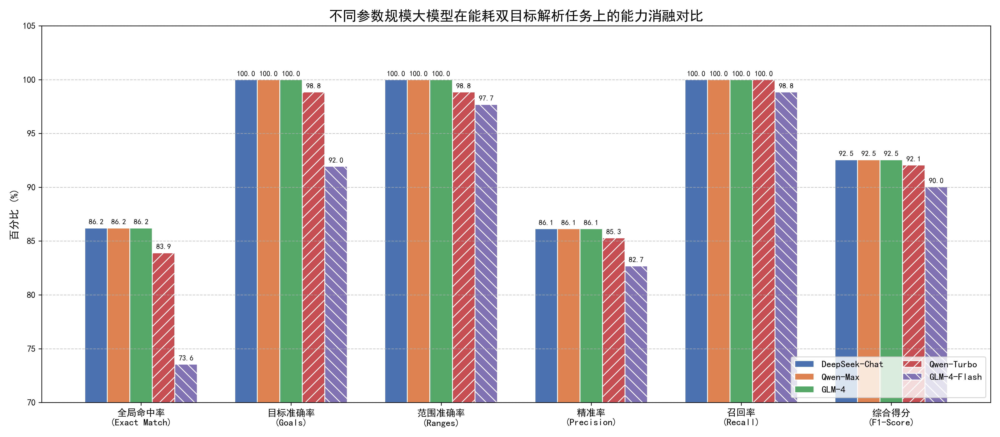
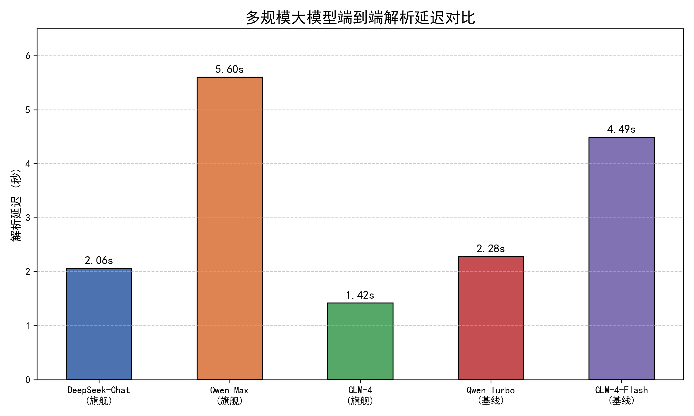

# undergraduate-essay

## 基于深度学习的多变量关联预测与可解释性分析系统

本科毕业设计项目。使用 Streamlit 构建交互界面，结合表格 Transformer、SHAP 和 NSGA-II，实现多变量预测、自然语言约束解析、方案寻优和解释报告。

### 主要功能

- 上传 CSV / Excel 数据，配置输入特征与预测目标。
- 训练表格 Transformer，并与 MLP、随机森林、XGBoost 进行对比。
- 使用 DeepSeek 将自然语言需求解析为变量约束与优化目标。
- 使用 NSGA-II 搜索方案，结合 SHAP 展示特征贡献。
- 展示方案对比、约束修复记录和生成式分析报告。

### 项目结构

```text
code/
  01_data_explore.py          数据探索
  02_baseline_model.py        随机森林基线
  03_deep_learning_model.py   深度学习模型训练
  04_explain_model.py         可解释性分析
  05_dashboard.py             早期展示界面
  06_transformer_model.py     Transformer 训练
  07_optimization_nsga2.py    多目标优化实验
  08_final_system.py          建筑能耗专用系统
  09_universal_system.py      通用系统（推荐入口）
  api_config.py              API 环境配置
data/                        数据与自然语言测试用例
images/                      已有实验结果图
saved_models/                早期实验的模型与缩放器
requirements.txt             依赖版本
run2.bat                     Windows 启动脚本
```

### 安装与启动

原开发环境为 Windows、Python 3.9.25、PyTorch 2.7.1（CUDA 11.8 构建）。依赖清单记录直接依赖版本，CPU 环境也可使用。GPU 安装需要匹配本机驱动的 PyTorch 构建。

在已安装 Python 3.9 的环境中执行：

```powershell
git clone https://github.com/Perry-xwr/undergraduate-essay.git
cd undergraduate-essay
python -m venv .venv
.\.venv\Scripts\python.exe -m pip install -r requirements.txt
.\run2.bat
```

启动脚本依次使用项目中的 `.venv`、原本地 `env_bishe` 或当前命令行中的 Python。界面地址以终端输出为准，通常为 `http://localhost:8501`。

也可以在激活项目环境后手动启动。早期脚本使用相对路径，请从 `code` 目录运行：

```powershell
$env:PYTHONUTF8 = "1"
cd code
python -m streamlit run 09_universal_system.py
# 建筑能耗专用版本：
# python -m streamlit run 08_final_system.py
```

### DeepSeek 配置

数据上传与模型训练不需要 API 密钥。自然语言解析和生成报告需要网络连接及个人 DeepSeek API 密钥。在启动应用的同一个 PowerShell 窗口设置环境变量：

```powershell
$env:DEEPSEEK_API_KEY = "替换为你自己的密钥"
.\run2.bat
```

项目不会自动读取 `.env` 文件。请勿将真实密钥写入源码或提交到 Git。使用这些功能时，相关指令、字段名称及报告所需的分析摘要会发送到 DeepSeek API。

### 使用流程

1. 进入“数据流与元数据”，上传数据并选择输入 X 与目标 Y。
2. 保存元数据，进入“AutoML 模型工厂”训练模型。
3. 进入寻优页面，设置当前方案并输入自然语言需求。
4. 查看优化结果、SHAP 解释与报告。

建筑能耗示例使用 `data/ENB2012_data.xlsx`：输入选择 `X1` 至 `X8`，目标选择 `Y1` 和 `Y2`。请手动调整默认选择，避免将目标列选入输入特征。

`data/index.csv` 为信贷字段数据，目标列是 `Creditability`；`data/archive/winequality-red.csv` 为红酒质量数据。若 CSV 未正确分列，应先检查分隔符并转换为逗号分隔 CSV 或 XLSX。`credit_eval_dataset_ranges_only.csv` 和三个“测试集”文本文件是自然语言约束测试用例，不作为模型训练表格使用。

### 数据、模型与实验图

仓库保留原项目中的实验数据、训练权重与结果图。各数据文件的原始来源、版本和许可信息尚待补充；本仓库不授予第三方数据的额外使用权。

`saved_models/` 对应早期能耗实验；通用系统在界面中根据上传数据重新训练。以下图片为项目已有实验输出，发布整理时未重新训练或复算指标。





### 当前限制

- 这是毕业设计研究原型，界面中的训练指标不能直接视为独立测试集上的泛化表现。
- 依赖版本来自原开发环境；不同操作系统、GPU 驱动或全新环境仍可能需要适配。
- 本仓库不包含本地 Python 环境、论文、AIGC 报告和工作总结。
- 尚未选择开源许可证。
